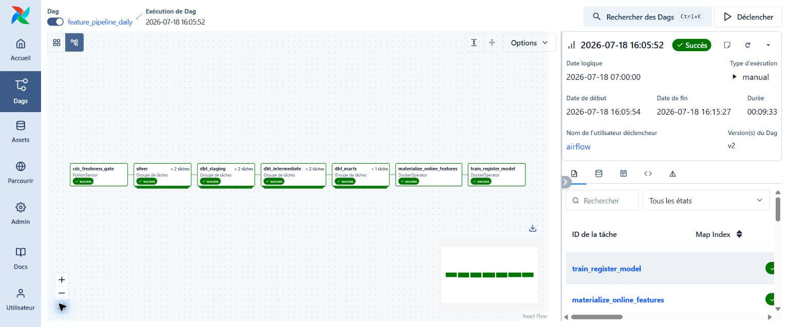
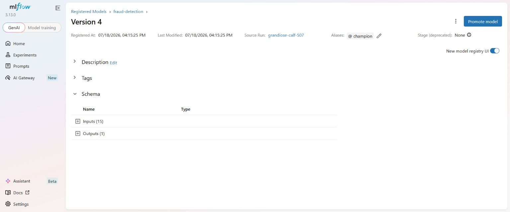
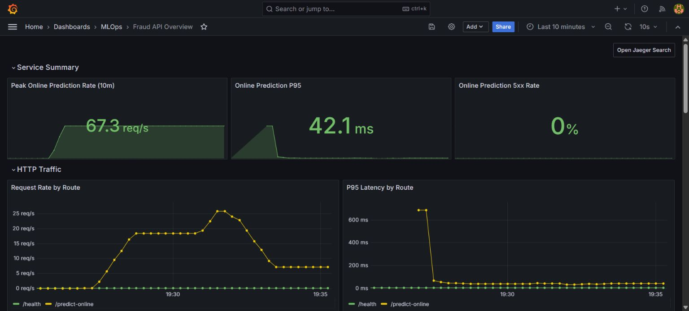
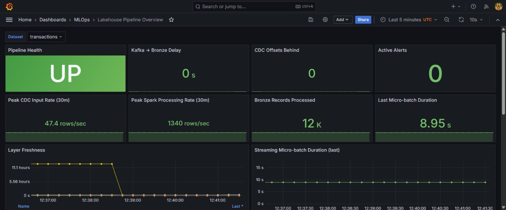
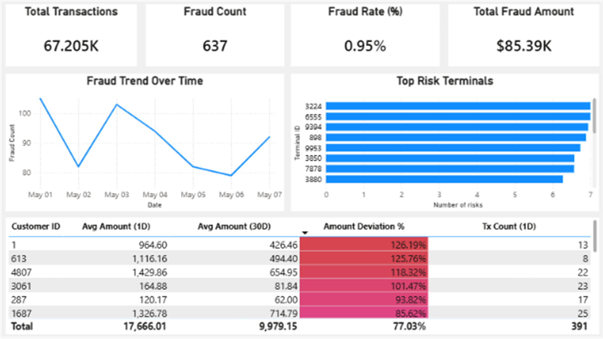
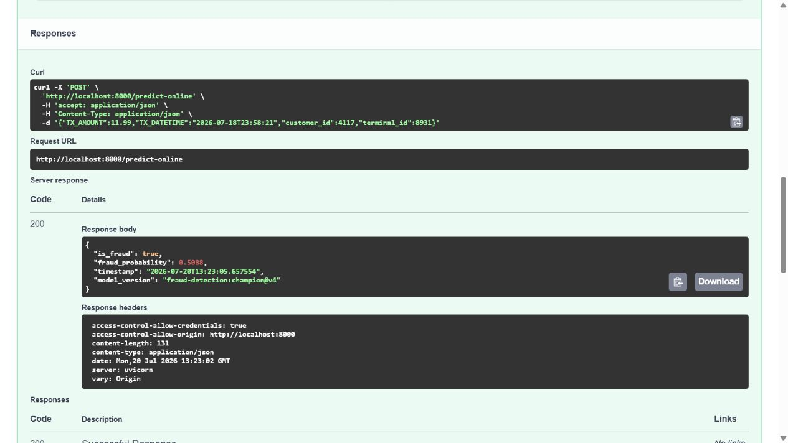

# End-to-End Banking Fraud Detection Platform

[](https://github.com/hoquangvinh124/End-to-End-Fraud-Detection-Data-ML-Platform/actions/workflows/ci.yml)
[](https://github.com/hoquangvinh124/End-to-End-Fraud-Detection-Data-ML-Platform/actions/workflows/build.yml)
[](https://www.python.org/)
[](https://docs.docker.com/compose/)

An end-to-end data and MLOps platform for processing banking transactions, producing fraud features, managing model versions, and serving online predictions. The project connects an event-driven lakehouse with a reproducible ML lifecycle in one Docker Compose environment.

## Table of Contents

- [Core Capabilities](#core-capabilities)
- [System Architecture](#system-architecture)
- [Platform Evidence](#platform-evidence)
- [Risk Analyst Dashboard](#risk-analyst-dashboard)
- [Repository Structure](#repository-structure)
- [Getting Started](#getting-started)
- [Service URLs](#service-urls)
- [Online Inference](#online-inference)
- [Development](#development)
- [CI and Container Delivery](#ci-and-container-delivery)

## Core Capabilities

- Captures PostgreSQL banking changes through Debezium, Kafka, and Schema Registry.
- Processes CDC events into Bronze and Silver Delta Lake tables with Spark Structured Streaming and idempotent merges.
- Builds tested fraud features with dbt and Trino, then serves the Gold feature mart through ClickHouse.
- Uses ClickHouse for offline training features and Feast with Redis for online feature retrieval.
- Tracks experiments and ONNX artifacts in MLflow, with model promotion through the `champion` alias.
- Serves online fraud predictions through FastAPI and ONNX Runtime.
- Orchestrates feature materialization and model training with Airflow.
- Exposes pipeline and API telemetry through OpenTelemetry, Prometheus, Grafana, Loki, and Jaeger.

## System Architecture

```text
PostgreSQL OLTP
      |
      | Debezium CDC
      v
Kafka + Schema Registry
      |
      | Spark Structured Streaming
      v
Bronze Delta Lake -> Silver Delta Lake -> Trino + dbt -> ClickHouse Gold
                                                        |             |
                                              Feast materialization  Training
                                                        |             |
                                                        v             v
                                                      Redis     MLflow Registry
                                                        |       champion alias
                                                        +-----> FastAPI + ONNX

Airflow orchestrates batch feature and model workflows.
OpenTelemetry routes metrics, logs, and traces to the observability stack.
```

<!-- Add docs/assets/architecture-overview.png here when the final diagram is ready. -->

## Platform Evidence

### Airflow Orchestration

The `feature_pipeline_daily` DAG gates execution on CDC freshness before running Silver processing, dbt transformations, Feast materialization, and model training.



### Model Registry

Training logs metrics and ONNX artifacts to MLflow, creates a registered model version, and assigns the `champion` alias used by the inference service.



### Observability

The API dashboard tracks request rate, p95 latency, errors, and runtime health. The lakehouse dashboard tracks CDC throughput, backlog, Spark micro-batches, layer freshness, and service availability.





## Risk Analyst Dashboard

The Power BI risk dashboard connects to the ClickHouse transaction feature mart and gives the banking Risk Analyst team one prioritisation view: **where, when, and how severe fraud is**.

- **Where:** Top Risk Terminals and customer-level amount deviations identify terminals and customers that need investigation first.
- **When:** the Fraud Trend Over Time chart reveals peaks and changes in daily fraud activity.
- **How severe:** transaction volume, fraud count, fraud rate, and total fraud amount quantify the exposure and support escalation decisions.



## Repository Structure

```text
MLOps/
|-- .github/workflows/       # CI checks and GHCR image publishing
|-- data/                    # Synthetic banking seed data
|-- docs/assets/             # README screenshots and architecture media
|-- models/                  # Local model fallback artifacts
|-- postgres/                # OLTP schema and PostgreSQL service
|-- src/
|   |-- api/                 # FastAPI serving and registry model loading
|   |-- batch_processing/    # Bronze-to-Silver Spark processing
|   |-- cdc/                 # Kafka, Schema Registry, and Debezium
|   |-- cdc_ingestion/       # Continuous CDC-to-Bronze jobs
|   |-- dbt/                 # Staging, feature models, and data tests
|   |-- feature_store/       # Feast definitions and Redis materialization
|   |-- lakehouse/           # MinIO, Hive Metastore, Trino, and ClickHouse
|   |-- mlflow/              # Tracking server and artifact storage
|   |-- monitoring/          # Dashboards, alerts, metrics, logs, and traces
|   |-- orchestration/       # Airflow deployment and DAGs
|   |-- pipeline_monitoring/ # Pipeline telemetry collectors
|   |-- tests/               # Unit, integration, and contract tests
|   `-- training/            # Training, ONNX export, and registration
|-- docker-compose.yml       # Complete local platform
|-- pyproject.toml           # Python dependencies and tool configuration
`-- README.md
```

## Getting Started

### Prerequisites

- Docker Desktop with Docker Compose v2 and Linux containers.
- At least 8 CPU cores, 16 GB RAM, and 30 GB of available disk space for the complete stack.
- Python 3.11 and [`uv`](https://docs.astral.sh/uv/) only when running development checks.

### Start the Platform

Create the local environment file, validate the Compose model, and start every service:

```powershell
Copy-Item .env.example .env
docker compose config --quiet
docker compose up -d --build
docker compose ps
```

Subsequent starts can reuse the existing images:

```powershell
docker compose up -d
```

Stop the platform while preserving its data volumes:

```powershell
docker compose down
```

## Service URLs

| Service | URL | Purpose |
| --- | --- | --- |
| FastAPI | [http://localhost:8000/docs](http://localhost:8000/docs) | Interactive API documentation and inference |
| MLflow | [http://localhost:5000](http://localhost:5000) | Experiments, artifacts, and Model Registry |
| Airflow | [http://localhost:8092](http://localhost:8092) | Pipeline orchestration and task logs |
| Grafana | [http://localhost:3000](http://localhost:3000) | API and lakehouse dashboards |
| Prometheus | [http://localhost:9090](http://localhost:9090) | Metrics and target health |
| Jaeger | [http://localhost:16686](http://localhost:16686) | Distributed traces |
| Kafka UI | [http://localhost:8080](http://localhost:8080) | Topics, messages, and consumer state |
| MinIO | [http://localhost:9001](http://localhost:9001) | Lakehouse objects and MLflow artifacts |

## Online Inference

Open [FastAPI Swagger UI](http://localhost:8000/docs) and use the interactive API directly:

1. Run `GET /health` to confirm that the promoted Registry model is loaded.
2. Open `POST /predict-online` and select **Try it out**.
3. Submit a transaction using customer and terminal IDs available in the online feature store.
4. Inspect the fraud decision, probability, model version, and response timestamp.



## Development

Install the development environment and run the same quality gates used by CI:

```powershell
uv sync --frozen --group dev
uv run ruff check .
uv run pytest --cov=api --cov-report=term-missing --cov-fail-under=80
```

## CI and Container Delivery

GitHub Actions runs linting and tests with an 80% API coverage gate on pull requests and pushes to protected branches. After CI succeeds on `main`, the Build workflow publishes the FastAPI image to `ghcr.io/hoquangvinh124/mlops` using an immutable commit-SHA tag and updates the `latest` tag.
