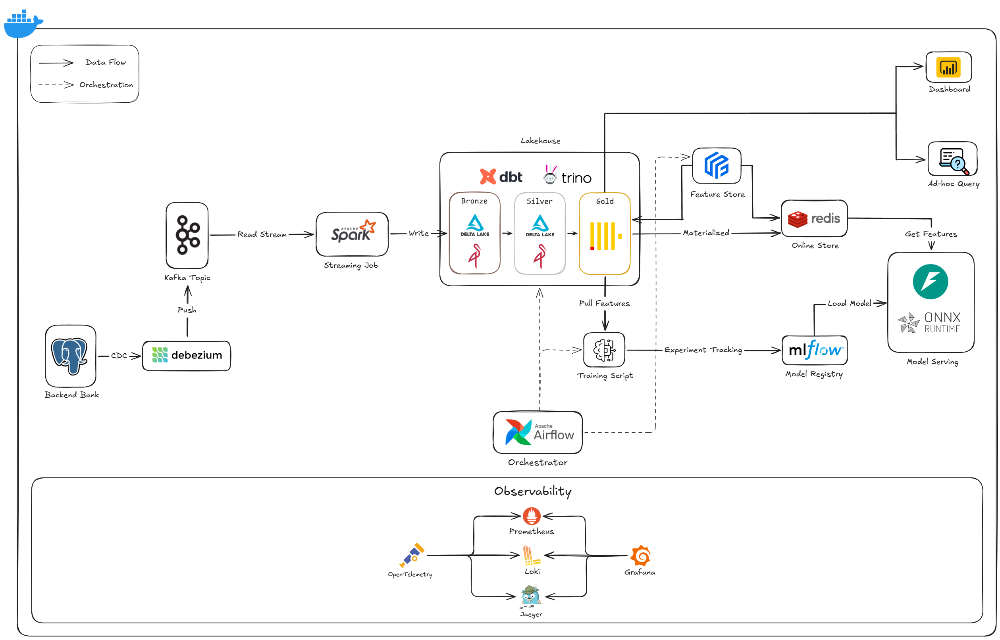

# End-to-End Banking Fraud Detection MLOps Platform

[](https://github.com/hoquangvinh124/MLOps/actions/workflows/ci.yml)
[](https://github.com/hoquangvinh124/MLOps/actions/workflows/build.yml)
[](https://www.python.org/)
[](https://docs.docker.com/compose/)

A local-first, end-to-end MLOps platform that turns banking transactions into continuously updated fraud features and serves registry-managed models through an observable API.

The repository demonstrates two connected engineering systems:

- **Banking lakehouse:** PostgreSQL OLTP -> Debezium/Kafka CDC -> Bronze and Silver Delta Lake -> dbt/Trino -> ClickHouse Gold.
- **ML lifecycle:** ClickHouse offline features -> Feast/Redis online features -> MLflow Registry -> ONNX Runtime/FastAPI -> Airflow and observability.

## What This Project Demonstrates

- Change data capture from a normalized PostgreSQL banking workload using Debezium, Kafka, and Schema Registry.
- Bronze ingestion and idempotent Silver normalization with Spark, Delta Lake, MinIO, and Hive Metastore.
- Tested feature transformations with dbt and Trino, materialized as a ClickHouse Gold feature mart.
- ClickHouse Gold as the offline training source, with Feast definitions and Redis materialization for low-latency customer/terminal features.
- Model experiment tracking, ONNX artifact logging, Registry versioning, and promotion through the MLflow `champion` alias.
- FastAPI inference that loads the promoted registry model and combines request-time fields with online features.
- Daily orchestration in Airflow, plus metrics, logs, and traces through Prometheus, Grafana, Loki, OpenTelemetry, and Jaeger.
- GitHub Actions quality gates and a post-CI container build published to GitHub Container Registry.

## Verified Demo Snapshot

The values below are evidence from the last successful local end-to-end run on **2026-07-11**. They describe that run, not fixed dataset guarantees.

| Check | Last verified result |
| --- | ---: |
| PostgreSQL OLTP transactions | 4,477,440 rows through 2026-07-11 |
| ClickHouse Gold feature mart | 36,515 rows through 2026-07-11 |
| Gold transaction ID uniqueness | 36,515 / 36,515 unique |
| Redis online store | 10,275 keys |
| Promoted MLflow model | `fraud-detection:champion` -> version 2 |
| dbt validation | 52 / 52 checks passed |
| Python test suite | 89 tests passed |
| API coverage | 87.98% (CI gate: 80%) |
| Online prediction | Valid probability returned from `/predict-online` |

Run the E2E verifier against your own environment to produce a current snapshot:

```powershell
.\scripts\e2e_demo.ps1 -ExpectedDate "2026-07-11"
```

## Current Architecture

```text
PostgreSQL OLTP
      |
      | Debezium CDC
      v
Kafka + Schema Registry
      |
      | Spark ingestion
      v
MinIO Bronze (Delta) -> Spark normalize/merge -> MinIO Silver (Delta)
                                                   |
                                                   | Trino + dbt
                                                   v
                                      ClickHouse Gold feature mart
                                         |                     |
                             Feast materialization      Offline training
                                         |                     |
                                         v                     v
                                      Redis              MLflow Registry
                                         |                 champion alias
                                         +---------+-----------+
                                                   |
                                                   v
                                      FastAPI + ONNX Runtime
                                                   |
                                      metrics, logs, and traces
                                                   |
                                                   v
                              Prometheus / Grafana / Loki / Jaeger

Airflow schedules and monitors the batch, feature, and training lifecycle.
```

<!--
ARCHITECTURE IMAGE PLACEHOLDER
Save the final diagram as docs/assets/architecture-overview.png.
Capture the implemented local data flow shown above. Keep GKE, KServe, and Argo CD out
of this diagram because they are roadmap items, not part of the current Compose stack.
Then uncomment the line below:

-->

### Pipeline Lifecycle

The `feature_pipeline_daily` Airflow DAG runs the implemented lifecycle in dependency order:

```text
CDC ingestion -> Bronze -> Silver -> dbt staging -> dbt intermediate -> dbt marts
-> Feast materialization -> train, register, and promote model
```

Training reads a bounded, time-ordered feature dataset from `gold.mart_fraud_ml_features`, logs metrics and artifacts to MLflow, exports an ONNX model, creates a Registry version, and moves the `champion` alias to the new version. The API resolves that alias on startup and prefers ONNX Runtime for inference.

## Getting Started

### Prerequisites

- Docker Desktop with Docker Compose v2 and Linux containers.
- PowerShell 7 for the provided E2E script.
- Python 3.11 and [`uv`](https://docs.astral.sh/uv/) for local development and tests.
- Recommended for the complete stack: 8 CPU cores, 16 GB RAM, and at least 30 GB of free disk space.

### Start the Local Platform

Create a local configuration file and review its development-only defaults:

```powershell
Copy-Item .env.example .env
docker compose config --quiet
docker compose up -d
docker compose ps
```

The master Compose file includes the OLTP, CDC, lakehouse, feature store, MLflow, API, Airflow, batch processing, and observability sub-stacks. Initial image builds and health checks can take several minutes.

Stop the stack without deleting persisted data:

```powershell
docker compose down
```

Delete local volumes only when a clean rebuild is intentional:

```powershell
docker compose down --volumes
```

### Prepared Demo vs. Full Rebuild

For an environment whose volumes already contain the current dataset, start Compose and run `scripts/e2e_demo.ps1`.

To rebuild the lifecycle from source data:

1. Load the original seed files into PostgreSQL with `src/scripts/load_oltp_seed.py`.
2. Extend the OLTP timeline with `src/scripts/generate_current_oltp_data.py`; by default it resumes after the latest stored transaction date and continues through `--end-date`.
3. Open Airflow, unpause `feature_pipeline_daily`, and trigger it for the target logical date.
4. Run the E2E verifier with the same date.

Example data commands:

```powershell
uv sync --frozen --group dev
uv run python src/scripts/load_oltp_seed.py --data-dir data
uv run python src/scripts/generate_current_oltp_data.py `
  --end-date 2026-07-11 `
  --daily-scale 0.10
```

When `--start-date` is omitted, the generator reads the latest OLTP transaction date and resumes on the following day. Generation is deterministic and append-oriented by default. Use `--reset` only when intentionally replacing the OLTP dataset.

## Service Endpoints

| Service | URL | Purpose |
| --- | --- | --- |
| FastAPI | [http://localhost:8000/docs](http://localhost:8000/docs) | Interactive inference API |
| MLflow | [http://localhost:5000](http://localhost:5000) | Experiments, artifacts, and Model Registry |
| Airflow | [http://localhost:8089](http://localhost:8089) | Pipeline scheduling and task logs |
| Grafana | [http://localhost:3000](http://localhost:3000) | Operational dashboards |
| Prometheus | [http://localhost:9090](http://localhost:9090) | Metrics and target health |
| Jaeger | [http://localhost:16686](http://localhost:16686) | Distributed traces |
| Kafka UI | [http://localhost:8080](http://localhost:8080) | Topics, messages, and consumer state |
| MinIO Console | [http://localhost:9001](http://localhost:9001) | Lakehouse objects and MLflow artifacts |
| Trino | [http://localhost:8090](http://localhost:8090) | SQL query endpoint |

Credentials are configured through `.env`; do not use the example defaults outside a local development environment.

## Inference API

Confirm that the promoted model is loaded:

```powershell
Invoke-RestMethod http://localhost:8000/health
```

Run online inference using request-time attributes and customer/terminal features retrieved from Feast and Redis:

```powershell
$body = @{
  customer_id = 1
  terminal_id = 42
  TX_AMOUNT = 150.50
  TX_DATETIME = "2026-07-11T12:30:00Z"
} | ConvertTo-Json

Invoke-RestMethod `
  -Method Post `
  -Uri http://localhost:8000/predict-online `
  -ContentType "application/json" `
  -Body $body
```

A successful response contains `is_fraud`, `fraud_probability`, `model_version`, and `timestamp`. Use an entity present in the materialized feature date; the E2E script selects one automatically from the Gold mart.

## Verification and Quality Gates

Run the same static checks and tests used by CI:

```powershell
uv sync --frozen --group dev
uv run ruff check .
uv run pytest --cov=api --cov-report=term-missing --cov-fail-under=80
```

Validate dbt models while Trino, MinIO, Hive Metastore, and ClickHouse are running:

```powershell
Set-Location src/dbt
uv run dbt deps
uv run dbt build --profiles-dir .
Set-Location ../..
```

The E2E script verifies the runtime contract across PostgreSQL, ClickHouse, Redis, MLflow, the loaded Registry model, and online inference:

```powershell
.\scripts\e2e_demo.ps1 -ExpectedDate "2026-07-11"
```

GitHub Actions runs Ruff and pytest with an 80% API coverage gate. After CI succeeds on `main` or `vinh-branch`, the build workflow publishes the API image to `ghcr.io/hoquangvinh124/mlops` with immutable commit-SHA tagging.

## Repository Guide

| Path | Responsibility |
| --- | --- |
| `postgres/` | PostgreSQL OLTP service and banking schema initialization |
| `src/cdc/` | Kafka, Schema Registry, Debezium Connect, and CDC initialization |
| `src/cdc_ingestion/` | Spark ingestion from Kafka CDC topics into Bronze |
| `src/batch_processing/` | Bronze-to-Silver normalization and Delta merge jobs |
| `src/dbt/` | Staging, intermediate, Gold feature models, and data tests |
| `src/feature_store/` | Feast entities, feature views, and Redis materialization |
| `src/training/` | Offline training, MLflow registration, and ONNX export |
| `src/api/` | FastAPI model loading, feature retrieval, and inference |
| `src/orchestration/` | Airflow deployment and the daily feature/model DAG |
| `src/monitoring/` | OpenTelemetry, Prometheus, Grafana, Loki, and Jaeger |
| `src/tests/` | Unit, integration, contract, and orchestration tests |
| `scripts/` | Operator-facing verification utilities |

## Visual Evidence

The image references below remain commented out until the screenshots are added, so the public README does not render broken assets.

<!--
AIRFLOW SCREENSHOT PLACEHOLDER
Save as docs/assets/airflow-dag.png.
Capture the feature_pipeline_daily Graph view after a successful run. Include task-group
names, green task states, logical date, and total duration; exclude credentials and URLs
containing tokens.
Then uncomment:

-->

<!--
MLFLOW SCREENSHOT PLACEHOLDER
Save as docs/assets/mlflow-registry.png.
Capture the fraud-detection registered model page with the champion alias, model version,
metrics, and ONNX artifact visible. Do not expose storage credentials or signed URLs.
Then uncomment:

-->

<!--
GRAFANA SCREENSHOT PLACEHOLDER
Save as docs/assets/grafana-dashboard.png.
Capture a representative inference window showing request rate, latency, error rate, and
model prediction metrics. Use a readable time range and remove unrelated local panels.
Then uncomment:

-->

## Current Scope and Roadmap

| Implemented locally | Planned production evolution |
| --- | --- |
| Docker Compose deployment | Kubernetes/GKE deployment |
| FastAPI with ONNX Runtime | KServe-managed model serving |
| GitHub Actions CI and GHCR image publishing | Argo CD GitOps promotion and rollback |
| Airflow `LocalExecutor` | Managed or Kubernetes-native orchestration |
| MinIO S3-compatible object storage | Cloud object storage and managed metadata services |

The planned column is intentionally not represented as completed work. The current repository is a reproducible local platform and engineering demonstration, not a production banking system.

## Configuration and Security

- Copy `.env.example` to `.env` and replace all defaults before using a shared environment.
- Keep `.env`, webhooks, tokens, and cloud credentials out of Git history.
- The optional Discord failure webhook is read from `DISCORD_WEBHOOK_URL`; leaving it empty disables notifications.
- Restrict API CORS, add authentication, enable TLS, and move secrets to a secret manager before any non-local deployment.
- Use synthetic banking data only. No real customer or payment data is required by this project.

## License

No open-source license has been declared yet. All rights are reserved by the repository owner unless a license is added.
