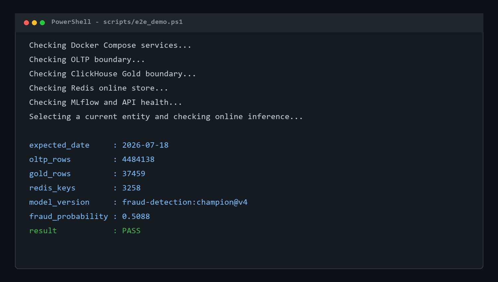

# End-to-End Banking Fraud Detection MLOps Platform

[](https://github.com/hoquangvinh124/MLOps/actions/workflows/ci.yml)
[](https://github.com/hoquangvinh124/MLOps/actions/workflows/build.yml)
[](https://www.python.org/)
[](https://docs.docker.com/compose/)

A local-first MLOps platform that moves synthetic banking transactions through CDC and lakehouse layers, produces fraud features, trains and registers an ONNX model, and serves online predictions through an observable API.

The repository demonstrates two connected engineering systems:

- **Banking lakehouse:** PostgreSQL OLTP -> Debezium/Kafka -> Bronze/Silver Delta Lake -> dbt/Trino -> ClickHouse Gold.
- **ML lifecycle:** ClickHouse offline features -> Feast/Redis online features -> MLflow Registry -> ONNX Runtime/FastAPI -> Airflow and observability.

## Table of Contents

- [What This Project Demonstrates](#what-this-project-demonstrates)
- [Verified Demo Snapshot](#verified-demo-snapshot)
- [Local Performance Snapshot](#local-performance-snapshot)
- [High-Level System Architecture](#high-level-system-architecture)
- [Repository Structure](#repository-structure)
- [Installation and Running](#installation-and-running)
- [Service Endpoints](#service-endpoints)
- [Inference API](#inference-api)
- [Automated Verification](#automated-verification)
- [CI and Container Delivery](#ci-and-container-delivery)
- [Current Scope and Roadmap](#current-scope-and-roadmap)
- [Configuration and Security](#configuration-and-security)
- [License](#license)

## What This Project Demonstrates

- Change data capture from a normalized PostgreSQL banking workload using Debezium, Kafka, and Schema Registry.
- Bronze ingestion and idempotent Silver normalization with Spark, Delta Lake, MinIO, and Hive Metastore.
- Tested feature transformations with dbt and Trino, materialized as a ClickHouse Gold feature mart.
- ClickHouse Gold as the offline training source, with Feast definitions and Redis materialization for low-latency customer and terminal features.
- Model experiment tracking, ONNX artifact logging, Registry versioning, and promotion through the MLflow `champion` alias.
- FastAPI inference that loads the promoted model and combines request-time fields with online features.
- Freshness-gated daily orchestration in Airflow while CDC ingestion remains continuously running.
- Lakehouse and API observability through OpenTelemetry, Prometheus, Grafana, Alertmanager, Loki, and Jaeger.
- GitHub Actions quality gates and container delivery to GitHub Container Registry.

## Verified Demo Snapshot

The values below come from the last successful local end-to-end run on **2026-07-18**. They are reproducible evidence from that run, not fixed dataset guarantees.

| Check | Last verified result |
| --- | ---: |
| PostgreSQL OLTP transactions | 4,484,138 rows through 2026-07-18 |
| ClickHouse Gold feature mart | 37,459 rows through 2026-07-18 |
| Gold transaction ID uniqueness | 37,459 / 37,459 unique |
| Redis online store | 3,258 keys |
| Promoted MLflow model | `fraud-detection:champion` -> version 2 |
| dbt validation | 52 / 52 checks passed |
| Python test suite | 144 tests passed |
| API coverage | 87.98% (CI gate: 80%) |
| Online prediction | Valid probability returned from `/predict-online` |



## Local Performance Snapshot

The results below were measured on **2026-07-14** using Docker Desktop on a Windows host with 16 logical CPUs and 15.7 GiB of RAM. They describe one local environment and are reproducible portfolio evidence, not production SLAs.

| Workload | Method | Verified result |
| --- | --- | ---: |
| Analyst daily aggregate | Equivalent 962-row result, 10 warm-ups and 100 measured queries per path | Gold serving path p95 **54.77 ms** vs. Silver query path p95 **3,366.07 ms** (**98.4% lower latency**) |
| Online fraud inference | 100 warm-ups, then 3 runs of 1,000 `/predict-online` requests at concurrency 10 | Median p95 **211.58 ms**, **71.17 requests/second**, **0% errors** |

The query benchmark verifies matching row count, unique transaction count, and average amount. It measures an end-to-end Silver query path against a purpose-built Gold serving path, not an isolated Trino-versus-ClickHouse engine comparison. The online benchmark includes Feast/Redis feature retrieval and ONNX Runtime inference through FastAPI.

## High-Level System Architecture

```text
PostgreSQL OLTP
      |
      | Debezium CDC
      v
Kafka + Schema Registry
      |
      | continuous Spark Structured Streaming
      v
MinIO Bronze (Delta)
      |
      | Airflow freshness gate -> Spark normalize/merge
      v
MinIO Silver (Delta) -> Trino + dbt -> ClickHouse Gold feature mart
                                               |              |
                                  Feast materialization   Offline training
                                               |              |
                                               v              v
                                            Redis       MLflow Registry
                                               |        champion alias
                                               +-------> FastAPI + ONNX

Pipeline and API telemetry -> OpenTelemetry Collector
      |-> Prometheus -> Grafana -> Alertmanager
      |-> Loki (logs)
      `-> Jaeger (traces)
```

> **Architecture diagram placeholder**
>
> Draw only the implemented local architecture shown above. Include service boundaries, storage layers, orchestration, model serving, and observability; keep GKE, KServe, and Argo CD out because they are roadmap items. Save it as `docs/assets/architecture-overview.png`, then replace this callout with ``.

### Orchestration Flow

CDC ingestion runs continuously as two Compose services. The `feature_pipeline_daily` Airflow DAG waits for healthy, sufficiently fresh CDC data before executing the bounded lifecycle:

```text
CDC freshness gate -> Bronze-to-Silver merge -> dbt staging -> dbt intermediate
-> dbt Gold mart -> Feast/Redis materialization -> train/register MLflow model
```


### Model Lifecycle

Training reads a bounded chronological window from `gold.mart_fraud_ml_features`, uses a reproducible stratified split, logs metrics and artifacts to MLflow, exports an ONNX model, creates a Registry version, and moves the `champion` alias to the new version. The API resolves that alias on startup and prefers ONNX Runtime for inference.


### Observability

OpenTelemetry instruments both the inference API and data pipeline. The Lakehouse dashboard covers CDC throughput, offset backlog, micro-batch duration, layer freshness, component health, Airflow task duration, and active alerts. The API dashboard covers request rate, p95 latency, HTTP errors, process resources, logs, and traces. Prometheus evaluates alert rules, Alertmanager optionally delivers firing and resolved incidents to Discord, Loki stores logs, and Jaeger exposes distributed traces.


## Repository Structure

```text
MLOps/
|-- .github/workflows/       # CI checks and GHCR container publishing
|-- data/                    # Local synthetic seed files (not shipped in images)
|-- docs/                    # Architecture, design notes, and future media assets
|-- models/                  # Local development model fallback
|-- postgres/                # PostgreSQL OLTP service and schema initialization
|-- scripts/                 # Operator-facing E2E verification
|-- src/
|   |-- api/                 # FastAPI, registry model loading, and inference
|   |-- batch_processing/    # Bronze-to-Silver Spark normalization
|   |-- cdc/                 # Kafka, Schema Registry, and Debezium Connect
|   |-- cdc_ingestion/       # Kafka CDC to Bronze ingestion jobs
|   |-- dbt/                 # Staging, intermediate, Gold models, and tests
|   |-- feature_store/       # Feast entities, feature views, and Redis materialization
|   |-- lakehouse/           # MinIO, Hive Metastore, Trino, and ClickHouse
|   |-- mlflow/              # MLflow tracking server and artifact configuration
|   |-- monitoring/          # Telemetry routing, dashboards, probes, and alert rules
|   |-- orchestration/       # Airflow deployment and daily pipeline DAG
|   |-- pipeline_monitoring/ # CDC, freshness, health, and batch metric instrumentation
|   |-- scripts/             # Seed loading and current-date data generation
|   |-- tests/               # Unit, integration, contract, and orchestration tests
|   `-- training/            # Offline training, ONNX export, and registration
|-- docker-compose.yml       # Master local platform definition
|-- pyproject.toml           # Python dependencies and tool configuration
`-- README.md                # Project overview and operating guide
```

## Installation and Running

### Prerequisites

- Docker Desktop with Docker Compose v2 and Linux containers.
- PowerShell 7 for the E2E verifier.
- Python 3.11 and [`uv`](https://docs.astral.sh/uv/) for development and tests.
- Recommended for the complete stack: 8 CPU cores, 16 GB RAM, and at least 30 GB of free disk space.

### Quick Start

Create a local configuration file, validate Compose, and start the platform:

```powershell
Copy-Item .env.example .env
.\scripts\start_stack.ps1
docker compose ps
```

After the local images have been built once, use the cached cold-start path:

```powershell
.\scripts\start_stack.ps1 -SkipBuild
```

The startup script validates Docker and Compose, builds cached local images,
waits for every required service, runs HTTP smoke checks, and prints focused
container logs when a service fails. The Silver batch image is built during
startup, while the batch jobs themselves run only through Airflow or the
explicit `batch` profile. Initial builds and health checks can take several
minutes.

Stop the stack while preserving data:

```powershell
docker compose down
```

Delete local volumes only when a clean rebuild is intentional:

```powershell
docker compose down --volumes
```

### Full Data and Model Rebuild

For an environment whose volumes already contain the verified dataset, start Compose and proceed directly to [Automated Verification](#automated-verification).

To rebuild from seed data:

1. Load the original synthetic seed files into PostgreSQL.
2. Extend the OLTP timeline through the required snapshot date.
3. Open Airflow, unpause `feature_pipeline_daily`, and trigger it for the target logical date.
4. Run the E2E verifier using the same date.

```powershell
uv sync --frozen --group dev
uv run python src/scripts/load_oltp_seed.py --data-dir data
uv run python src/scripts/generate_current_oltp_data.py `
  --daily-scale 0.10
```

When `--start-date` is omitted, the generator reads the latest OLTP transaction date and resumes on the following day. Generation is deterministic and append-oriented by default. Use `--reset` only when intentionally replacing the OLTP dataset.

## Service Endpoints

| Service | URL | Purpose |
| --- | --- | --- |
| FastAPI | [http://localhost:8000/docs](http://localhost:8000/docs) | Interactive inference API |
| MLflow | [http://localhost:5000](http://localhost:5000) | Experiments, artifacts, and Model Registry |
| Airflow | [http://localhost:8092](http://localhost:8092) | Pipeline scheduling and task logs |
| Grafana | [http://localhost:3000](http://localhost:3000) | Operational dashboards |
| Prometheus | [http://localhost:9090](http://localhost:9090) | Metrics and target health |
| Alertmanager | [http://localhost:9093](http://localhost:9093) | Pipeline alert routing and status |
| Jaeger | [http://localhost:16686](http://localhost:16686) | Distributed traces |
| Kafka UI | [http://localhost:8080](http://localhost:8080) | Topics, messages, and consumer state |
| MinIO Console | [http://localhost:9001](http://localhost:9001) | Lakehouse objects and MLflow artifacts |
| Trino | [http://localhost:8090](http://localhost:8090) | SQL query endpoint |

Credentials are configured through `.env`; do not use the example defaults outside local development.

## Inference API

Confirm that the promoted Registry model is loaded:

```powershell
Invoke-RestMethod http://localhost:8000/health
```

Run online inference using request-time attributes and customer/terminal features retrieved from Feast and Redis:

```powershell
$body = @{
  customer_id = 1
  terminal_id = 42
  TX_AMOUNT = 150.50
  TX_DATETIME = "2026-07-18T12:30:00Z"
} | ConvertTo-Json

Invoke-RestMethod `
  -Method Post `
  -Uri http://localhost:8000/predict-online `
  -ContentType "application/json" `
  -Body $body
```

A successful response contains `is_fraud`, `fraud_probability`, `model_version`, and `timestamp`. Use an entity present in the materialized feature date; the E2E script selects one automatically from Gold.

## Automated Verification

Run the same static checks and tests used by CI:

```powershell
uv sync --frozen --group dev
uv run ruff check .
uv run pytest --cov=api --cov-report=term-missing --cov-fail-under=80
```

Validate dbt while Trino, MinIO, Hive Metastore, and ClickHouse are running:

```powershell
Set-Location src/dbt
Copy-Item profiles.yml.example profiles.yml
uv run dbt deps
uv run dbt build --profiles-dir .
Set-Location ../..
```

Verify PostgreSQL, ClickHouse, Redis, MLflow, the loaded model, and online inference together:

```powershell
.\scripts\e2e_demo.ps1
```

Reproduce the local Silver/Gold query comparison and online inference load test:

```powershell
uv run python scripts/benchmark_portfolio.py --expected-date 2026-07-11
```

## CI and Container Delivery

GitHub Actions runs Ruff and pytest with an 80% API coverage gate for pull requests and protected branch pushes. After CI succeeds on an internal push to `main` or `vinh-branch`, the Build workflow publishes the API image to `ghcr.io/hoquangvinh124/mlops` with a commit-SHA tag.

This is continuous delivery to a container registry, not automatic deployment to a runtime environment. The complete platform is currently deployed locally through Docker Compose.

## Current Scope and Roadmap

| Implemented locally | Planned production evolution |
| --- | --- |
| Docker Compose deployment | Kubernetes/GKE deployment |
| FastAPI with ONNX Runtime | KServe-managed model serving |
| GitHub Actions CI and GHCR publishing | Argo CD GitOps promotion and rollback |
| Airflow `LocalExecutor` | Managed or Kubernetes-native orchestration |
| MinIO S3-compatible object storage | Cloud object storage and managed metadata services |

The planned column is intentionally not represented as completed work. This repository is a reproducible local platform and engineering demonstration, not a production banking system.

## Configuration and Security

- Copy `.env.example` to `.env` and replace all defaults before using a shared environment.
- Keep `.env`, webhooks, tokens, and cloud credentials out of Git history.
- The optional Discord failure webhook is read from `DISCORD_WEBHOOK_URL`; leaving it empty disables notifications.
- Restrict API CORS, add authentication, enable TLS, and move secrets to a secret manager before any non-local deployment.
- Use synthetic banking data only. No real customer or payment data is required.

## License

No open-source license has been declared yet. All rights are reserved by the repository owner unless a license is added.
